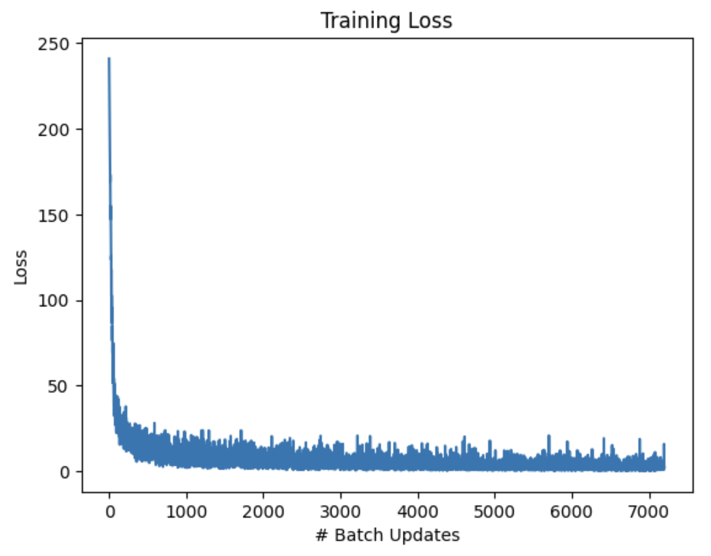
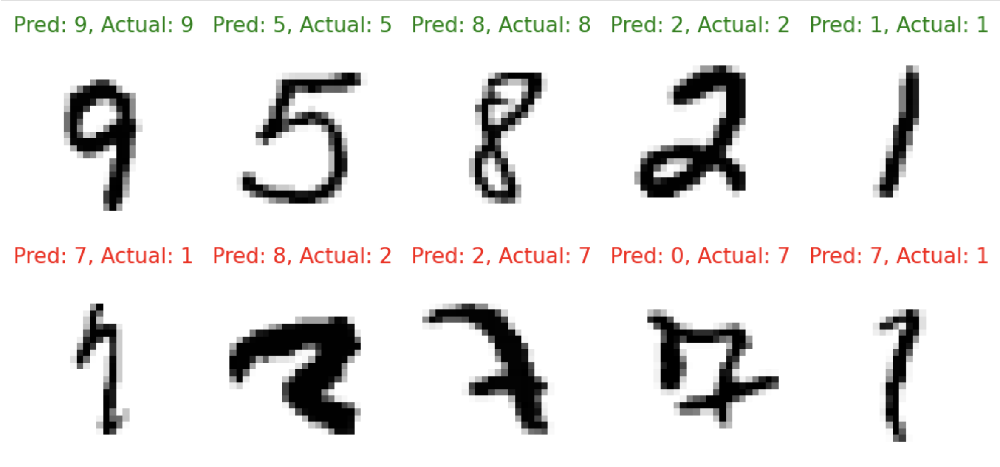

# Jax-Based CNN for Character Image Classification

## Summary
This repository contains code to build, train, and evaluate a CNN for classifying images in the MNIST character dataset (numbers 0-9). This is a common dataset used for image classification, and this code is an exercise in how to do so in Jax.

**Credits:**Some of this code comes from (and/or is based off) [Robert Lange's JAX CNN tutorial](https://roberttlange.com/posts/2020/03/blog-post-10/).

Our model consists of 3 convolutional layers, with batch normalization between each one and ReLU's after each one. The model then flattens and softmaxes the output for the classification task.

## Training Results
We trained a CNN using the MNIST dataset of about 60K training images for 12 epochs. Our training loss converges fairly quickly, with and end training accuracy of 99.4% and test accuracy of 98.4%.

## Examples
Below are examples of correct and incorrect predictions from the final trained model. Some of the incorrect ones are pretty difficult even for humans to discern, so we can see qualitatively the model performs well.

